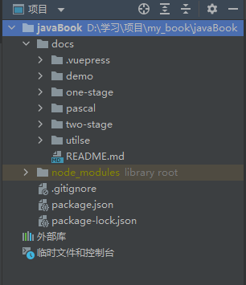
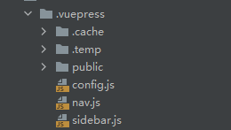
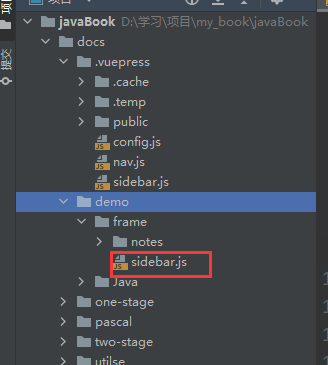
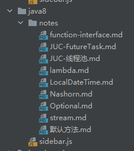
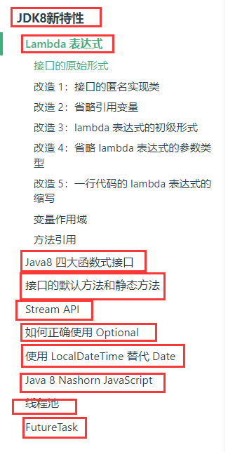

### 第一步 环境搭建

- 安装git

- 安装node.js

- 安装npm 

注意：node.js自带npm 但是有可能版本比较低，需要升级 

```shell
# 升级npm到最新版本
npm install -g npm 
```

安装完成之后可使用 `node -v` `npm-v`检查是安装成功。

### 第二步 拉取代码

1、在本地创建文件夹

2、在文件夹目录下打开cmd 运行 git clone url(远程仓库地址)

### 第三步 结构介绍

将拉取下来的文件夹使用vscode或者其他编码软件打开，代码结构如下：



- javabook：是项目的根文件夹
- docs：放着所有的代码，包括配置文件，文档内容。
- .vuepress：里面是所有的配置文件，顶部导航栏的配置，侧边栏的配置等等。
- demo（日常积累）、one-stage（一）、pascal（数据结构与算法）、two-stage（二）、utilse（工具库）：里面都是文档以及每个侧边栏的配置
- README.md：网站首页

### 第四步 启动项目

打开终端

安装插件：

```shell
# 安装vuepress插件
npm install -D vuepress@next

# 安装search插件
npm install @vuepress/plugin-search
# 完成之后运行项目
npm run docs:dev

# 输入localhost：4950访问项目
```

### 第五步 .vuepress配置介绍



上面三个文件夹不用管

config.js(不需要改)

```js
module.exports = {
    // 站点配置
    lang: 'zh-CN',
    title: 'Java笔记',
    description: 'I LOVE CHINA',
    dest: './dist',
    port: '4950',
    head: [
        [
            'link', // 设置 favicon.ico，注意图片放在 public 文件夹下
            {rel: 'icon', href: 'logo.png'}
        ],
        [
            'script', {}, `
            var _hmt = _hmt || [];
            (function() {
                var hm = document.createElement("script");
                hm.src = "https://hm.baidu.com/hm.js?f1bb2cadd6233359a7e375f48570aab5";
                var s = document.getElementsByTagName("script")[0]; 
                s.parentNode.insertBefore(hm, s);
            })();
        `],
    ],
    markdown: {
        lineNumbers: true
    },
    // 主题和它的配置
    theme: '@vuepress/theme-default',
    themeConfig: {
        logo: 'logo.png',
        contributors: false,
        sidebarDepth: 1,
        lastUpdated: 'Last Updated',
        navbar: require("./nav.js"),
        sidebar: require("./sidebar.js"),


    },

    plugins: [
        [
            '@vuepress/plugin-search',
            {
                maxSuggestions: 22,
            },
        ],
    ],
}
```

nav.js 顶部导航栏配置 

可以理解成：一个顶部导航就是一个文件夹

```js
module.exports = [
    //格式：
    {
        text: '顶部导航栏文字',
        children: [
            {text: '下拉框文字1', link: '点击下拉框文字1之后跳转的url'},
            {text: '下拉框文字2', link: '点击下拉框文字2之后跳转的url'},
            {text: '下拉框文字3', link: '点击下拉框文字3之后跳转的url'},
            {text: '下拉框文字4', link: '点击下拉框文字4之后跳转的url'},
            {text: '下拉框文字5', link: '点击下拉框文字5之后跳转的url'},
        ]
    }
    //例子:
    {
        text: '工具库',
        children: [
            {text: 'Guava工具库', link: '/utilse/guava/notes/字符串工具类.html'},
            {text: 'Spring内置工具库', link: '/utilse/spring-utils/notes/top-4.html'},
            {text: '其他工具库', link: '/utilse/else/notes/slf4j.html'},
            {text: '各种模板', link: '/utilse/gist/notes/jdbc.html'},
            {text: 'docker搭建常用容器', link: '/utilse/docker/notes/docker搭建常用容器.html'},
        ]
    },
]
```

sidebar.js （侧边导航栏配置）

注意：sidebar.js里面是所有侧边导航栏的集中配置，每个下拉框选项有多个文档，他们的配置都在自己所在的文件夹里面

可以理解成：每个下拉框选项都是一个文件夹




```js
module.exports = {
    //例子：
    '/utilse/guava': require('../utilse/guava/sidebar'),
    '/utilse/spring-utils': require('../utilse/spring-utils/sidebar'),
    '/utilse/else': require('../utilse/else/sidebar'),
    '/utilse/gist': require('../utilse/gist/sidebar'),
    '/utilse/docker': require('../utilse/docker/sidebar'),
}
```



上图中的sidebar.js配置如下

```js
module.exports = [
	{
		text:'JDK8新特性',
		collapsable: false,
		link:'/one-stage/java8/notes/lambda.html',
		children:[
			'lambda.html',
			'function-interface.html',
			'默认方法.html',
			'stream.html',
			'Optional.html',
			'LocalDateTime.html',
			'Nashorn.html',
			'JUC-线程池.html',
			'JUC-FutureTask.html',
		]
	},
]
//效果如下图
```




